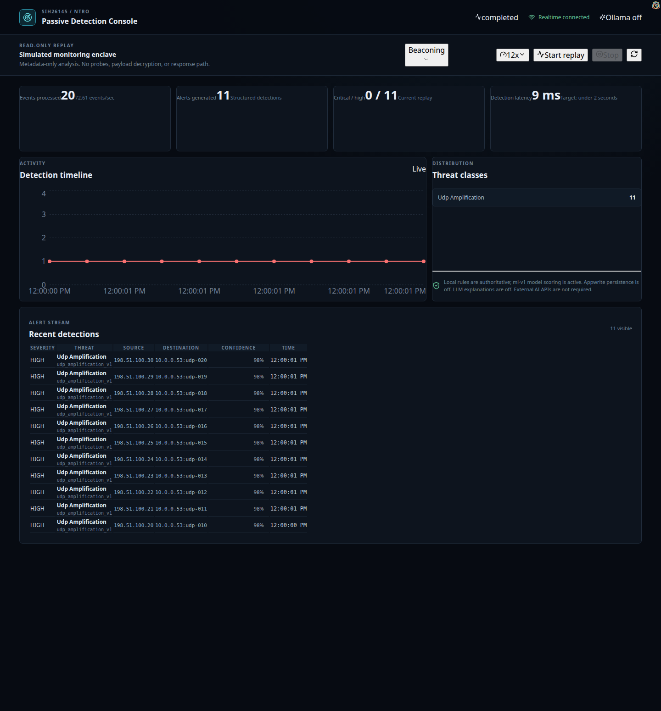

# SIH 2026 Submission — PS 26145

**AI-Based Detection of Cyber Threats in Unidirectional IP Traffic**

| Field | Value |
|---|---|
| Problem Statement ID | 26145 |
| Organization | National Technical Research Organisation (NTRO) |
| Category | Software |
| Theme | Blockchain & Cybersecurity |
| Repository | https://github.com/archduke1337/SIH26145 |

---

## 1. Problem summary

Critical-infrastructure operators observe their gateway and peering links using passive mirroring or hardware data diodes that copy traffic into a monitoring enclave **in one direction only**. The enclave can see everything crossing the link but has **no physical or protocol-level path back** into the production network. Any intelligence layer in that enclave must work purely from passively observed data — packet captures, exported flow records (NetFlow/IPFIX/sFlow), and derived metadata — with **no ability to send probes, complete handshakes with the traffic source, or push a mitigation command back**.

The objective: an AI/ML pipeline that ingests a one-directional stream of IP traffic, detects/classifies/scored cyber-security threats **in near real time**, using only passively collected data, and outputs **labelled alerts, confidence scores, and supporting evidence** on a visualisation dashboard.

### Threat classes the system must detect

| # | Threat class | Detection signals |
|---|---|---|
| a | Volumetric / protocol DDoS (SYN floods, UDP reflection/amplification, spoofed-source floods) | flow-level rate and source-IP entropy statistics |
| b | Botnet C2 beaconing | periodicity and inter-arrival analysis on repeating flows |
| c | DGA domains and DNS tunnelling | entropy / n-gram analysis, query-length and record-type anomalies |
| d | Malware inside encrypted sessions | TLS/QUIC metadata only (JA3/JA3S or JA4 fingerprints, packet-size and timing sequences), no decryption |
| e | Reconnaissance and port scanning | fan-out from one source across many ports/hosts |
| f | Data exfiltration | asymmetric flow-volume anomalies, unusual outbound/inbound byte ratios |

---

## 2. Solution overview

We built a **working prototype** (source repository) implementing the full pipeline: **ingest → feature extraction → model inference → alert output**, plus a **live dashboard**.

```
Synthetic traffic fixtures (JSONL)
        │  read-only replay (rate-controlled)
        ▼
Python streaming worker
   ├── event validation (Pydantic)
   ├── keyed sliding-window state (bounded per-key deques)
   ├── feature extraction (rates, entropy, periodicity, byte ratios, TLS metadata)
   ├── 9 rule-based detectors (deterministic, authoritative)
   ├── local scikit-learn RandomForest layer (enriches alerts)
   └── alert construction (standardized schema)
        │
        ├── FastAPI control/metrics API + WebSocket alert stream
        ├── Appwrite Databases + Realtime (optional persistence/delivery)
        └── React/TypeScript dashboard (severity, confidence, evidence)
```

**Design principle:** rules are authoritative and deterministic; local ML enriches alerts (confidence adjustment, anomaly scores) only when a rule fires; an optional small local LLM (Ollama) explains already-generated alerts and never makes detection decisions. The full demo runs 100% locally — no external AI API, no credentials required.

---

## 3. Requirement traceability

Every constraint in the expected solution is explicitly addressed:

| Expected-solution requirement | How the prototype satisfies it |
|---|---|
| **a. Read-only ingest** | The detector treats input as strictly append-only. There is no client that can send traffic, complete handshakes, or issue commands to observed hosts (see `docs/SECURITY.md`). |
| **b. No payload decryption** | TLS/QUIC sessions are analysed from metadata only (version, JA3-style fingerprints, packet-size and timing sequences). Payloads are never decrypted or stored (see `docs/ALERT_SCHEMA.md`, `docs/DETECTION_AND_ML.md`). |
| **c. Streaming, not batch** | Events are processed incrementally through bounded per-key sliding windows; alerts are emitted during the stream over WebSocket with bounded latency — not as an end-of-run report. |
| **d. Defined throughput target** | **Declared target: ≥ 60 events/sec sustained, p95 latency < 100 ms at 100 events/sec.** Measured: **61.7 events/sec sustained (~0.12 Mbps); p95 = 32.3 ms** (p50 18.4 ms, p99 39.8 ms). Reproducible via the built-in benchmark (see §7 and `docs/TESTING.md`). |
| **e. Standardized alert schema** | Every alert is a structured record: timestamp, flow ID, threat class, confidence (0–1), severity, and supporting evidence features with values and reasons (see §8 and `docs/ALERT_SCHEMA.md`). |

Threat coverage against the problem statement:

| PS threat | Implemented detector | Fixture scenario |
|---|---|---|
| a. Volumetric/protocol DDoS | `ddos` (SYN flood), `udp_amplification`, `slowloris` | `syn_flood.jsonl`, `udp_amplification.jsonl`, `slowloris.jsonl` |
| b. Botnet C2 beaconing | `botnet_beaconing` | `beaconing.jsonl` |
| c. DGA domains + DNS tunnelling | `dga`, `dns_tunnelling` | `dga.jsonl`, `dns_tunnelling.jsonl` |
| d. Malware in encrypted sessions | `encrypted_session_anomaly` | `encrypted_session.jsonl` |
| e. Reconnaissance/port scanning | `port_scanning` | `port_scanning.jsonl` |
| f. Data exfiltration | `data_exfiltration` | `exfiltration.jsonl` |

Each fixture produces exactly its intended threat class in isolation and in sequence (verified end-to-end; see `docs/LOCAL_DEMO.md`).

---

## 4. Architecture

| Component | Technology | Responsibility |
|---|---|---|
| Detection engine | Python 3.11+ | Event validation, window state, features, rules, ML inference, alert construction |
| API / control plane | FastAPI + Uvicorn | Replay control, metrics, historical alerts, WebSocket alert stream |
| Traffic replay | JSONL fixtures (rate-controlled) | Deterministic, reproducible scenarios (PCAP adapter planned) |
| Features & ML | NumPy/SciPy features; scikit-learn RandomForest + Isolation Forest | Enrichment and anomaly scoring on top of rules |
| Alert validation | Pydantic | Structured, validated alert records |
| Application backend | Appwrite (optional adapter) | Alert persistence (Databases) and realtime delivery (Realtime) |
| Dashboard | React + TypeScript + Vite, HeroUI + Tailwind, Recharts | Live metrics, timeline, threat distribution, alert table, evidence drawer |
| Explanation layer | Qwen2.5-3B-Instruct via Ollama (optional) | Plain-language explanations of structured alerts |
| Deployment | Docker Compose or local processes | Reproducible demo environment |

Full detail: `docs/ARCHITECTURE.md`, `docs/TECH_STACK.md`.

---

## 5. Detection and ML

**Hybrid three-layer design:**

1. **Rules** — recognizable, high-confidence behavior (thresholds with evidence).
2. **Statistics** — rates, entropy, periodicity, deviations from baseline.
3. **Local ML** — RandomForest classifier over 9 threat classes + benign, and IsolationForest anomaly scoring on benign windows.

**Model:** scikit-learn RandomForest (40 trees, depth 12, single-process inference), 15 window-level metadata features (rates, ratios, entropy, periodicity, byte asymmetry, TLS metadata). Artifacts are versioned under `models/` with `model_meta.json`.

**Evaluation is scenario-separated:** training windows are generated with one seed; the evaluation set uses a disjoint seed (`--eval-seed`, default `seed + 1000`), so the model is measured on windows it never saw — no train/test leakage by construction.

**Measured per-class metrics** (2,500 training + 2,500 evaluation windows):

| Class | Precision | Recall | F1 |
|---|---|---|---|
| benign | 1.00 | 1.00 | 1.00 |
| ddos | 1.00 | 1.00 | 1.00 |
| port_scanning | 1.00 | 1.00 | 1.00 |
| dns_tunnelling | 1.00 | 1.00 | 1.00 |
| dga | 1.00 | 1.00 | 1.00 |
| botnet_beaconing | 1.00 | 1.00 | 1.00 |
| encrypted_session_anomaly | 1.00 | 1.00 | 1.00 |
| data_exfiltration | 1.00 | 1.00 | 1.00 |
| udp_amplification | 1.00 | 1.00 | 1.00 |
| slowloris | 1.00 | 1.00 | 1.00 |

**Honest interpretation:** the synthetic generators are intentionally cleanly separable (e.g. benign DNS entropy ≈ 0.7 vs DGA ≈ 3.4 vs tunnelling ≈ 4.2), so perfect scores validate the *pipeline and methodology*, not real-world performance. The per-class evaluation framework is in place to report meaningful metrics once labeled real or lab-generated traffic exists (training data policy in `docs/DETECTION_AND_ML.md`).

**Confidence:** documented detector score — when the local model agrees with the rule, confidence blends rule (60%) + model (40%), capped at 0.99. Confidence is presented as a score, not a calibrated probability.

---

## 6. Alerts (standardized schema)

Required fields per the problem statement — timestamp, flow identifier, threat class, confidence score, and supporting evidence:

```json
{
  "timestamp": "2026-08-25T12:30:15.245Z",
  "flow_id": "10.0.0.4:53144-10.0.0.53:53",
  "threat_class": "dns_tunnelling",
  "confidence": 0.94,
  "evidence": [
    {
      "feature": "query_entropy",
      "value": 4.82,
      "reason": "DNS label entropy is above the learned baseline"
    }
  ]
}
```

Full record (recommended) adds `alert_id`, `severity`, source/destination, protocol, `window_seconds`, `detector`, `model_version`, and optional `explanation`. See `docs/ALERT_SCHEMA.md`.

---

## 7. Performance benchmark

The problem statement requires solutions to *state and demonstrate* the traffic rate they were tested against. Run:

```bash
PYTHONPATH=backend/src python3 -m sih_detector.cli --benchmark --benchmark-events 5000 --benchmark-rate 100
```

**Declared target and measured results** (Python 3.12, scikit-learn 1.9, CPU, measured 2026-08-26):

| Metric | Target | Measured |
|---|---|---|
| Sustained throughput | ≥ 60 events/sec | **61.7 events/sec (~0.12 Mbps)** |
| p95 per-event latency at 100 events/sec | < 100 ms | **32.3 ms** (p50 18.4 ms, p99 39.8 ms) |

Methodology: synthetic stream of 95% benign / 5% attack traffic from diverse sources; warm-up excluded; separate unpaced (throughput) and paced (latency) phases; ML scoring runs only when a rule fires. Full protocol in `docs/TESTING.md`.

Benchmarking surfaced and fixed four real performance defects: quadratic window scaling (now bounded per-key deques), per-prediction multiprocessing (now single-process), ML scoring on every event (now only on rule fires), and repeated DNS feature recomputation (now cached).

---

## 8. Dashboard



The dashboard presents detections live with **severity and confidence** as required:

- Scenario-driven replay controls (9 scenarios, adjustable speed)
- Realtime metrics (events processed, alerts generated, critical/high count, detection latency)
- Detection timeline chart and threat-class distribution
- Alert stream table: severity chip, threat class + detector, source/destination, confidence bar, timestamp
- Detail drawer with supporting evidence (feature → value → reason) and optional LLM explanation
- Status chips for WebSocket/Appwrite/Ollama connectivity

---

## 9. Demo walkthrough (what judges see)

1. **Start the stack** (2 commands, fully local — see §10).
2. Open `http://localhost:5173` — the dashboard loads with the API and WebSocket connected.
3. Pick a scenario (e.g. **Port scanning**) → **Start replay** → alerts stream in live with severity chips and confidence bars within ~1 second.
4. Click an alert → the drawer shows the flow, the **supporting evidence** (why it was flagged), and (with Ollama) a plain-language explanation.
5. Repeat across the 9 scenarios — each produces its intended threat class.
6. Optionally run the throughput/latency benchmark (§7) to demonstrate the declared traffic rate.

The full end-to-end run (all 9 scenarios through the WebSocket stream, alert contract, replay guards, explain endpoint, Vite proxy, and headless-browser render) is verified in `docs/LOCAL_DEMO.md`.

---

## 10. Run it

**Option A — local processes**

```bash
python -m pip install -e 'backend[test,ml]'
uvicorn sih_detector.api:app --app-dir backend/src --reload
```

```bash
cd frontend && npm install && npm run dev   # http://localhost:5173
```

**Option B — Docker Compose**

```bash
docker compose up
```

Optional adapters (not required for the demo): Appwrite persistence/realtime and Ollama explanations — see `.env.example`, `docs/LOCAL_DEMO.md`.

---

## 11. Repository layout

```text
backend/src/sih_detector/   detection engine, API, CLI, benchmark
backend/tests/              pytest suite (24 tests)
data/fixtures/              9 scenario fixtures (JSONL)
frontend/                   React/TypeScript dashboard
docs/                       full documentation set
models/                     trained model artifacts (ml-v1)
```

## 12. What's next

- PCAP/NetFlow ingest adapter for live or recorded captures (detection logic unchanged).
- Labeled real or lab-generated traffic (iperf3/Ostinato/TRex benign; hping3/Slowloris/dnscat2 attack) to populate meaningful per-class metrics.
- Gradient-boosting comparison and confidence calibration.
- Appwrite auth/RBAC for multi-analyst use.
